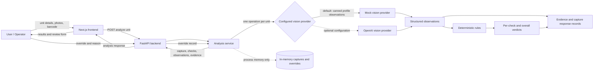

# Prep Manager — Architecture

## 1. System Overview

Prep Manager is a local prototype for collecting unit preparation inputs and returning per-check compliance results for operator review. Its intended flow is photo, camera, and optional barcode input; a FastAPI analysis request; provider observations; deterministic rule evaluation; and a response containing checks, evidence references, and capture information for the Next.js UI.

These are separate responsibilities:

- **Observation extraction:** the configured vision provider returns structured observations. The default mock provider selects canned values from a demo profile and does not inspect image pixels.
- **Compliance decision:** deterministic rules map observation values to `PASS`, `FAIL`, or `UNCERTAIN`; the provider does not return final compliance verdicts.
- **Human review:** an operator can submit an override with the original verdict, replacement verdict, reason, operator ID, and timestamp. It is stored as a separate in-memory review record; it does not rewrite the analysis response.

## 2. Architecture Diagram



The optional OpenAI provider is implemented in code but is not the default demo configuration. The schema is not an active database service and is therefore not shown as a live persistence path.

## 3. Components

| Component | Technology | Responsibility | Current Status |
|---|---|---|---|
| Frontend | Next.js, React, TypeScript | Unit fields, multiple photo upload, camera capture, browser barcode scanning where supported, manual barcode entry, results, evidence display, and override form | Implemented; local demo UI |
| Backend API | FastAPI | Health check, unit analysis, and override endpoints | Implemented; local API |
| Vision provider | Python provider interface; deterministic mock; optional OpenAI HTTP client | Return structured observations in one operation for a unit | Mock is default; OpenAI provider is selectable by server environment configuration |
| Rules engine | Python deterministic mappings | Map observations to check verdicts and calculate an overall verdict | Implemented; rule sources are not authoritatively connected |
| Data/models | Pydantic | Define units, captures, photos, barcode scans, observations, checks, evidence, and overrides | Implemented request/response models |
| Evidence/record handling | Pydantic objects and Python in-memory dictionaries | Link evidence IDs to observations/checks; retain captures and overrides during process lifetime | Implemented in memory only; no durable persistence |
| Tests | pytest, FastAPI `TestClient`, mocked HTTP | Exercise API flows, rule mapping, provider behavior, failure and override scenarios | Automated backend tests present; not model-accuracy evaluation |

## 4. Data Flow

1. The operator enters a unit ID, organization ID, and optional SKU, ASIN, and FNSKU in the frontend.
2. The operator may upload supported images or take a browser camera photo. A barcode can be scanned with the browser `BarcodeDetector` when available, or entered manually. Barcode scanning is separate from analysis.
3. On explicit submission, the frontend sends the unit, photo payloads, and optional barcode scan to `POST /api/v1/units/analyze` on FastAPI.
4. The service creates a capture and invokes the configured provider once for the unit. The default mock uses the selected demo profile and ignores image pixels. The optional OpenAI implementation sends provided image data URLs in one server-side request.
5. The deterministic rules evaluate returned observation values. Unknown or insufficient values become `UNCERTAIN`; a check declared not applicable is returned as `PASS` by the current rules.
6. Each returned observation receives a corresponding `PASS`, `FAIL`, or `UNCERTAIN` check. The overall result prioritizes `FAIL`, then `UNCERTAIN`, otherwise `PASS`.
7. For returned observations, the service creates evidence objects and associates their IDs with the observation and check. A provider exception instead returns a pending capture and no evidence objects.
8. FastAPI returns the capture, observations, checks, evidence, overall status, and call count. The frontend displays the results and permits an operator to submit a separate override record.

## 5. Model / Agent Usage

- The current beta uses `MockVisionProvider` by default (`VISION_PROVIDER=mock`). It returns deterministic, profile-selected observations; uploaded images are not analyzed in mock mode.
- The current demo does **not** claim that uploaded images were analyzed by an external vision model or OpenAI.
- A `VisionProvider` abstraction and `build_provider()` configuration exist. `.env.example` lists `VISION_PROVIDER`, `OPENAI_API_KEY`, and `OPENAI_VISION_MODEL`. The key is read by the backend process; no key is included in the example file.
- An optional `OpenAIVisionProvider` implementation makes one server-side request to the Chat Completions API for the unit's image payloads and parses structured observations. It is not the default mode and has no verified evaluation results in this repository.
- `RULES.md` requires one model call per unit carrying all checks. The service/provider design and tests implement one provider operation per unit; this is distinct from a claim that an external model is called in the current mock configuration.

## 6. Decision Logic

The implemented design is:

```text
Vision observations
        ↓
Deterministic rules
        ↓
Compliance verdict
```

For each check, recognized observation values in `rules.py` map to `PASS` or `FAIL`; all other values map to `UNCERTAIN`. An explicitly non-applicable check is currently `PASS`. Overall status is `FAIL` if any check fails, otherwise `UNCERTAIN` if any check is uncertain, otherwise `PASS`.

`UNCERTAIN` means the observation is insufficient for a reliable judgment; it is not a low-confidence pass. Authoritative preparation requirements and applicability should be looked up and configured, not inferred from the synthetic sample CSV. Rule source URLs and verified versions are currently unset. The current implementation also returns an overall `PASS` for an empty check list; incomplete provider output is not yet guarded against.

## 7. Evidence and Traceability

An evidence object contains a generated evidence ID, capture ID, check ID, observation, source type, optional source reference, optional reference location, optional bounding box, and explanation. The service links the evidence ID to the observation and corresponding check. A capture carries unit and organization IDs, photo references/payloads, optional barcode scan, timestamp, and analysis status.

Mock evidence identifies its mock source/profile and explicitly states that no image was analyzed and no bounding box is claimed. For other providers, locations are included only if returned by the provider. Captures, evidence, observations, and checks are returned in the API response; capture and override objects are held in process memory, not saved to the SQL schema. These records are not immutable, tamper-proof, or cryptographically anchored.

The SQL draft's evidence source constraint does not include `provider_observation`, although that value is allowed by the Pydantic model and emitted by the service for non-mock providers. This mismatch must be reconciled before persistence integration.

## 8. Human Review and Override

The UI lets an operator choose a replacement verdict and provide a reason and operator ID. The override API record contains the supplied original verdict, new verdict, reason, operator ID, organization ID, unit ID, generated review ID, and timestamp. The original verdict remains present in that separate record. The frontend displays whether the request was recorded, but the service does not update the analysis result, validate the supplied original verdict against a stored check, or provide an endpoint to retrieve review history. Records last only for the process lifetime.

## 9. Failure Handling

- **Provider exception:** the service retains the capture in memory, marks it `pending`, creates `model_unavailable` observations and uncertain checks, returns `PENDING_REVIEW`, and does not create evidence objects. This is implemented fail-open behavior: the operator receives a response rather than a blocked analysis, but persistence beyond process memory is not provided.
- **Uncertain observations:** deterministic rules return `UNCERTAIN`; this remains a valid per-check and overall outcome unless another check fails.
- **Incomplete evidence:** mock observations can produce mock evidence even when no photos were supplied; this evidence is explicitly not image-derived. Provider evidence locations are optional. If a successful provider returns no observations, the current rules produce no checks and the overall result is `PASS`; the implementation does not yet treat empty/incomplete output as pending or uncertain.
- **Pending review:** the UI displays `PENDING_REVIEW` when the provider raises an exception. There is no queue or persistent review workflow in the current beta.

## 10. Security and Tenancy

`backend/schema.sql` defines `org_id` on tenant-owned tables and SQL to enable and force row-level security with policies using `app.current_org_id`. However, the FastAPI service does not connect to this schema or set a transaction tenant context. It stores data in process memory, has no authentication/authorization layer, and accepts organization identifiers from requests. Photo payloads travel to the API when submitted; there is no implemented object store or image-access authorization path.

**Required by the challenge engineering rules; not fully implemented in the current beta.** The schema contains a forced-RLS draft, but runtime tenant isolation, cross-organization access tests, and protected image retrieval are not implemented. The OpenAI key, if that optional provider is selected, is read server-side from the environment; `.env.example` contains variable names and no secret value. No production secret-management system is implemented.

## 11. Testing

Automated backend tests cover:

- Analysis API response, one provider call, evidence linkage, and mock evidence labeling.
- `UNCERTAIN` results and provider-failure pending behavior.
- Multiple photos and barcode data on a capture.
- Override records retaining original and new verdicts and a reason.
- Rule value mapping, overall verdict precedence, applicability, and unset authoritative sources.
- Mock-provider observations and optional OpenAI provider selection/parsing using a mocked HTTP response.

These are software behavior tests, not model/evaluation accuracy tests. No held-out labeled image set, accuracy, false-positive/false-negative counts, or label-agreement results are documented; see the [evaluation report](submissions/mdsuhana231-gif/eval-report.md).

## 12. Engineering Decisions

- One provider operation handles the checks for a unit; observations are separated from deterministic compliance decisions.
- `UNCERTAIN` is an explicit outcome, and provider failure returns a pending-review response rather than a compliance claim.
- Evidence IDs connect observations to checks, while mock provenance is labeled instead of presented as image evidence.
- A provider abstraction permits configuration, but mock remains the current default and optional live vision is not validated.
- Overrides are represented separately with the original verdict and review details; they are currently process-local and do not alter the displayed analysis result.

## 13. Current Beta Limitations

- Default vision behavior is deterministic and mock-based; it does not understand uploaded images.
- Authoritative preparation requirements are not retrieved or verified, and rule source URLs are unset.
- Records are in memory only and do not survive backend restarts.
- Forced RLS exists in a schema draft but is not connected to runtime tenant isolation; authentication and image access controls are also absent.
- Empty provider output can currently yield an overall `PASS` with no checks.
- No verified model evaluation, performance metrics, or production deployment are documented.

## 14. Future Production Architecture

The following are **FUTURE / NOT CURRENTLY IMPLEMENTED**:

- A production vision provider, validated against representative held-out images.
- Retrieval and versioning of authoritative preparation requirements and per-unit applicability.
- Integrated production database and image storage, with authenticated organization context, enforced tenant isolation, and tested image access.
- Deployed and monitored infrastructure, operational retention controls, and durable review history.
- A larger held-out evaluation set with independent labels and per-check results, including false positives, false negatives, uncertainty, and failure modes.

## 15. Repository References

- [README.md](README.md)
- [RULES.md](RULES.md)
- [LOCAL_DEVELOPMENT.md](LOCAL_DEVELOPMENT.md)
- [backend/README.md](backend/README.md)
- [backend/app/main.py](backend/app/main.py)
- [backend/app/models.py](backend/app/models.py)
- [backend/app/vision.py](backend/app/vision.py)
- [backend/app/rules.py](backend/app/rules.py)
- [backend/app/service.py](backend/app/service.py)
- [backend/schema.sql](backend/schema.sql)
- [backend/tests](backend/tests)
- [frontend/README.md](frontend/README.md)
- [frontend/app/page.tsx](frontend/app/page.tsx)
- [.env.example](.env.example)
- [Evaluation report](submissions/mdsuhana231-gif/eval-report.md)
- [Evidence record shape](submissions/mdsuhana231-gif/contract/evidence-record.md)
- [Submission README](submissions/mdsuhana231-gif/README.md)
- [Build brief](submissions/mdsuhana231-gif/build-brief.md)
- [Build log](submissions/mdsuhana231-gif/build-log.md)
- [Durable project constraints](submissions/mdsuhana231-gif/CLAUDE.md)